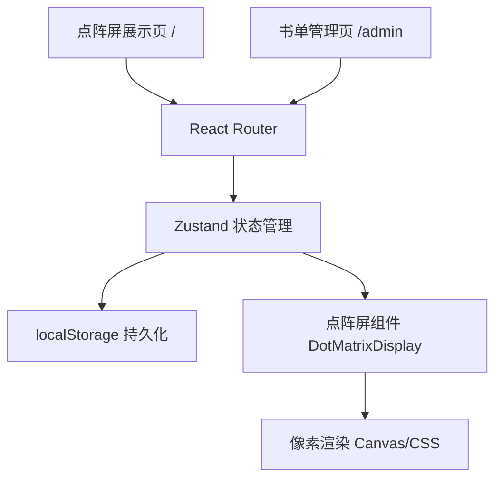
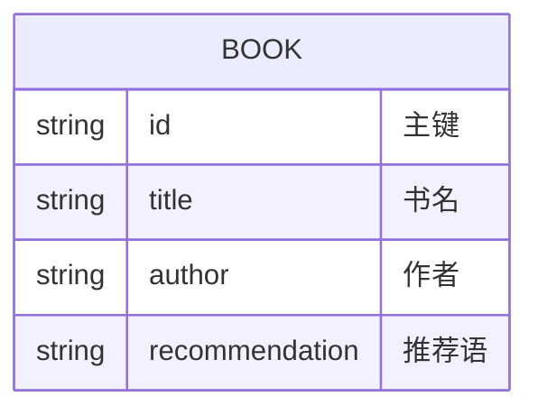

## 1. 架构设计



## 2. 技术说明
- 前端：React@18 + TypeScript + Vite
- 样式：Tailwind CSS
- 状态管理：Zustand
- 路由：react-router-dom
- 后端：无（纯前端）
- 数据存储：localStorage

## 3. 路由定义
| 路由 | 用途 |
|-------|---------|
| / | 点阵屏主展示页 |
| /admin | 书单管理编辑页 |

## 4. 数据模型

### 4.1 数据模型定义



### 4.2 数据结构
```typescript
interface Book {
  id: string;
  title: string;
  author: string;
  recommendation: string;
}

interface BookStore {
  books: Book[];
  currentIndex: number;
  addBook: (book: Omit<Book, 'id'>) => void;
  updateBook: (id: string, book: Omit<Book, 'id'>) => void;
  deleteBook: (id: string) => void;
  nextBook: () => void;
}
```

### 4.3 localStorage Key
- Key: `mystery-bookstore-books`
- 默认书单数据包含5本经典推理小说
