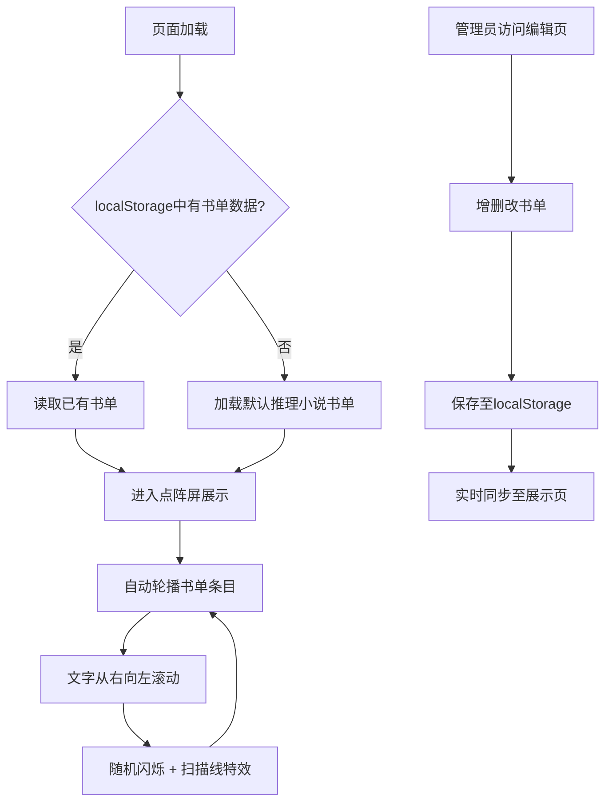

## 1. 产品概述

推理小说主题书店复古点阵屏推荐系统，模拟老式LED点阵屏风格展示今日推荐书单，用于店内挂屏展示。
- 主要用途：书店挂屏展示推荐书单、管理员后台编辑书单
- 目标用户：书店顾客（观看展示）、书店管理员（编辑内容）
- 产品价值：营造复古氛围、沉浸式推理主题体验

## 2. 核心功能

### 2.1 用户角色
| 角色 | 登录方式 | 核心权限 |
|------|---------|---------|
| 顾客 | 无需登录 | 观看点阵屏展示内容 |
| 管理员 | 直接访问编辑页 | 编辑书单内容 |

### 2.2 功能模块
1. **点阵屏展示页：像素风文字滚动、条目自动轮播、闪烁特效、扫描线效果
2. **书单管理页：书单增删改、localStorage 持久化

### 2.3 页面详情
| 页面名称 | 模块名称 | 功能描述 |
|-----------|---------|---------|
| 点阵屏展示页 | 点阵屏主区域 | 黑色背景暖橙色光点、书名/作者/推荐语从右向左滚动、不同条目自动轮流显示 |
| 点阵屏展示页 | 视觉特效层 | 随机闪烁效果、扫描线动画、像素字体渲染 |
| 书单管理页 | 书单列表 | 显示当前所有书单条目，支持添加、编辑、删除操作 |
| 书单管理页 | 编辑表单 | 输入书名、作者、推荐语字段 |

## 3. 核心流程

顾客进入书店，抬头观看挂屏，点阵屏自动循环展示推荐书单，文字从右向左缓缓滚动，偶尔闪烁模拟真实LED点阵效果。管理员通过独立页面编辑书单内容，数据保存在浏览器本地。

## 4. 用户界面设计

### 4.1 设计风格
- 主色调：纯黑背景 `#000000`、暖橙色光点 `#ff7b00`、深红色辅助 `#ff4500`
- 字体：像素风字体（Press Start 2P 或 VT323）
- 按钮风格：点阵化边框、复古工业风
- 布局风格：全屏展示，文字居中点阵区域
- 图标风格：极简、像素化

### 4.2 页面设计概览
| 页面名称 | 模块名称 | UI元素 |
|-----------|---------|---------|
| 点阵屏展示页 | 主展示区 | 纯黑背景、像素点阵光点、从右向左滚动动画、随机闪烁像素、扫描线覆盖层 |
| 书单管理页 | 管理界面 | 暖橙色边框表单、书单列表卡片、增删改按钮 |

### 4.3 响应式
- 桌面端优先：全屏展示模式
- 自适应：点阵屏区域按比例缩放
- 管理页：移动端友好的表单布局

### 4.4 动效设计
- 文字滚动：从右向左平滑滚动
- 闪烁效果：随机像素点随机时刻随机闪烁
- 扫描线：自上而下匀速扫描
- 条目切换：淡出淡入切换书单条目
